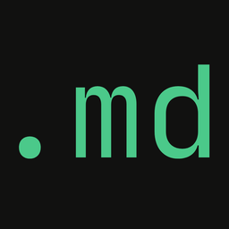

## `Prof. Dr. Jesimar Arantes` |   **Área: Ciência da Computação** 

  
<b>🛠️ Algumas linguagens, ferramentas e pacotes que utilizo:</b>

   
  
  
   
   
   
   
  
  
  
  
  
	
	
	
	
	
	
	
	
	
	
	
	
	
	
	
	
	
	
	
	
	
	
	
	
	
	
	
	
	
	

https://devicon.dev/

##
 

  <h4 align="right"> Visitantes </h4>
  
   

 
