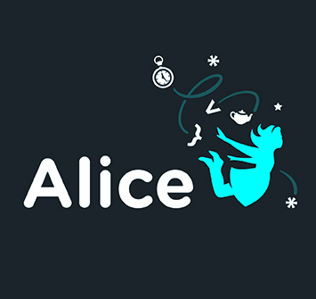
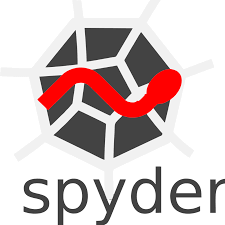

	<table>
		<tr>
			<td></td>
			<td></td>
		</tr>
	</table>

### Sejam todas e todos bem-vindos!

Sou professor na Universidade Federal de Lavras (UFLA)

	
<b>🛠️ Algumas linguagens que utilizo:</b>

	 
	
	
	
	
	
	
	
	
	
	
	

	
<b>🛠️ Algumas ferramentas e softwares que utilizo:</b>

	 
	
	
	
	
	
	
	
	
	
	
	
	
	
	
	
	
	
	
	
	
	
	
	
	
	
	
	
	
	
	
	
	
	
	
	
	
	
	
	
	

	
<b>🛠️ Alguns pacotes e bibliotecas que utilizo:</b>

	 
	
	
	

	
<b>🛠️ Alguns links para meus perfis em outras plataformas:</b>

	 
	<ul>
		<li> <a href="http://lattes.cnpq.br/0006398308745834">Meu Perfil no Lattes</a>: Plataforma para divulgação do meu currículo acadêmico. </li> 
		<li> [Meu Perfil no Google Scholar](https://scholar.google.com.br/citations?user=dnfjNm4AAAAJ&hl=pt-BR): Plataforma para análise de meus artigos científicos. </li>
		<li> [Meu Perfil no ORCID](https://orcid.org/0000-0002-1776-1514): Plataforma para divulgação das minhas contribuições acadêmicas. </li>
		<li> [Meu Perfil no ResearchGate](https://www.researchgate.net/profile/Jesimar-Arantes): Plataforma para divulgação de conteúdo acadêmico relacionado a pesquisa. </li>
		<li> [Meu Perfil no Slideshare](https://pt.slideshare.net/JesimarArantes): Plataforma para divulgação de alguns materiais (textos) produzidos. </li>
		<li> [Meu Repositório no Github](https://github.com/jesimar): Plataforma para divulgação de códigos e projetos desenvolvidos. </li>
		<li> [Meu Repositório no Gitlab](https://gitlab.com/jesimar): Plataforma para divulgação de alguns códigos e projetos desenvolvidos. </li>
		<li> [Meu Canal no Youtube - Pessoal](https://www.youtube.com/c/JesimarArantes): Plataforma para divulgação de vídeos pessoais e de pesquisa. </li>
		<li> [Meu Canal no Youtube - Trabalho](https://www.youtube.com/@prof.jesimararantes): Plataforma para divulgação de vídeos relacionados ao trabalho. </li>
		<li> [Meu Perfil no Greefoot](https://www.greenfoot.org/users/56822): Plataforma para divulgação de aplicações desenvolvidas no ambiente Greenfoot. </li>
		<li> [Meu Perfil no Replit](https://replit.com/@jesimar): Plataforma para divulgação de alguns códigos e projetos. </li>
		<li> [Meu Blog - Pessoal](https://jesimararantes.blogspot.com/): Plataforma para divulgação de alguns conteúdos avulsos (desatualizado). </li>
		<li> [Meu Perfil no Openclipart](https://openclipart.org/artist/Jesimar%20da%20Silva%20Arantes): Plataforma para divulgação de algumas imagens livres. </li>
	</ul>

##
 

  <h4 align="right"> Visitantes </h4>
  
   

 
